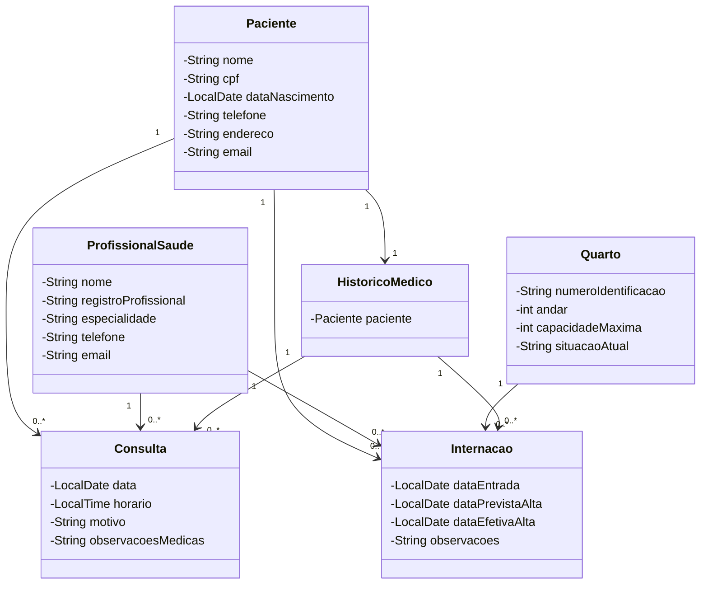

# Diagrama de Classes — Sprint 1

```mermaid
classDiagram
    class Paciente {
        -String nome
        -String cpf
        -LocalDate dataNascimento
        -String telefone
        -String endereco
        -String email
    }

    class ProfissionalSaude {
        -String nome
        -String registroProfissional
        -String especialidade
        -String telefone
        -String email
    }

    class Consulta {
        -LocalDate data
        -LocalTime horario
        -String motivo
        -String observacoesMedicas
    }

    class Internacao {
        -LocalDate dataEntrada
        -LocalDate dataPrevistaAlta
        -LocalDate dataEfetivaAlta
        -String observacoes
    }

    class Quarto {
        -String numeroIdentificacao
        -int andar
        -int capacidadeMaxima
        -String situacaoAtual
    }

    class HistoricoMedico {
        -Paciente paciente
    }

    Paciente "1" --> "0..*" Consulta
    ProfissionalSaude "1" --> "0..*" Consulta

    Paciente "1" --> "0..*" Internacao
    ProfissionalSaude "1" --> "0..*" Internacao
    Quarto "1" --> "0..*" Internacao

    Paciente "1" --> "1" HistoricoMedico
    HistoricoMedico "1" --> "0..*" Consulta
    HistoricoMedico "1" --> "0..*" Internacao
```

## Observação

Modelagem inicial da Sprint 1. Métodos e detalhes das próximas camadas ainda não foram incluídos.
